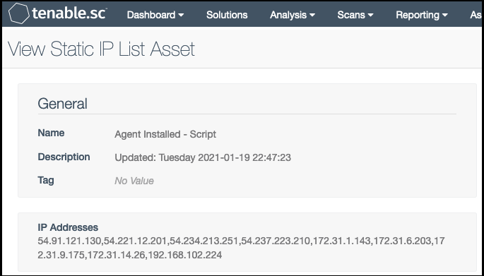

# agents-to-ag
agents-to-ag.py gathers IPv4 addresses for all Nessus Agents connected to Tenable.IO and then creates a Static IP Asset Group in Tenable.SC named "*Agent Installed - Script*" with these IPv4 addresses. 

IPv4 addresses are gathered in the following ways:
* Assets with a Source of Nessus Agent that have received an authenticated scan within the specified time frame.
   * This call is made because the Assets export will include all IPv4 addresses for an asset. However, it requires that an Agent scan has run.
* Agents connected to Tenable.IO within the specified time frame that have never been scanned.
   * This call is made to capture the IPv4 address of any agent that recently connected to Tenable.IO but has not yet run a scan. However, this method will not capture all IPv4 addresses on the host since a scan is required for that. It will only capture the IPv4 address reported by the agent upon initial connection.

Tenable.SC does have built in "*Scanned with...Agent*" Asset Groups. However, these Asset Groups require an Agent scan to have run and synchronized from Tenable.IO in order to populate. Also, most organizations are not synchronizing agent data more than once a day. This script aims to provide a more complete and up to date list of agents.
## Requirements
* python3
* [pyTenable](https://github.com/tenable/pyTenable)
* Tenable.SC 5.13 or later is required for [API key usage](https://docs.tenable.com/tenablesc/Content/GenerateAPIKey.htm)

## Installation
### Python virtual environment
```
$ git clone https://github.com/andrewspearson/agents-to-ag.git /usr/local/bin/agents-to-ag
$ python3 -m venv /usr/local/bin/agents-to-ag/venv
$ . /usr/local/bin/agents-to-ag/venv/bin/activate
$ pip install -r requirements.txt
$ deactivate
```
### Cron entry
```
$ crontab -l

0 * * * * /usr/local/bin/agents-to-ag/venv/bin/python /usr/local/bin/agents-to-ag/agents-to-ag.py --config /usr/local/bin/agents-to-ag/tenable.ini
```
## Usage
### Python virtual environment
View the help menu
```
$ cd /usr/local/bin
$ ./venv/bin/python agents-to-ag.py -h

usage: agents-to-ag.py [-h] (--config <tenable.ini> | --config-gen)

Auto populate a TSC Static Asset Group with IPs with Nessus agents.

optional arguments:
  -h, --help            show this help message and exit
  --config <tenable.ini>
                        INI config file
  --config-gen          Generate a new INI config file.

```
Generate a configuration file
```
$ ./venv/bin/python agents-to-ag.py --config-gen

Wrote file: tenable.ini
Edit the new INI configuration file for your environment.
```
Edit the configuration file so it looks something like this
```
$ cat tenable.ini

[tenable_io]
########
# Connection info
########
access_key = deadbeefdeadbeefdeadbeefdeadbeefdeadbeefdeadbeefdeadbeefdeadbeef
secret_key = deadbeefdeadbeefdeadbeefdeadbeefdeadbeefdeadbeefdeadbeefdeadbeef
https_proxy =
########
# Data variables
########
# Include all assets that were last seen within x days (Default: 7)
last_seen = 7

[tenable_sc]
########
# Connection info
########
endpoint = 127.0.0.1
access_key = deadbeefdeadbeefdeadbeefdeadbeef
secret_key = deadbeefdeadbeefdeadbeefdeadbeef
https_proxy =
ssl_verify = False
```
Run the script
```
$ ./venv/bin/python agents-to-ag.py --config tenable.ini
```
## Results


